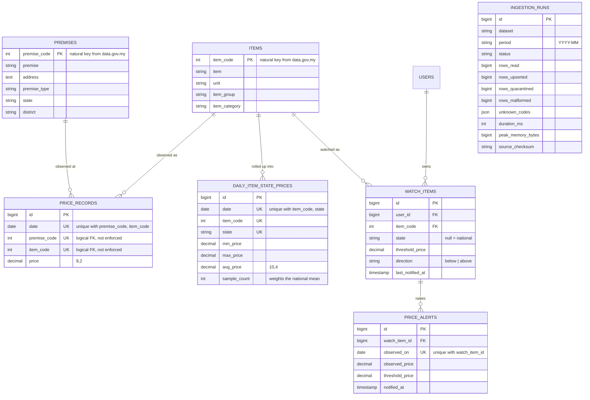

# Entity relationship diagram

`INGESTION_RUNS` has no relationships by design — it is an audit log about the
pipeline, not about the data, and nothing should cascade from it.

## Why `price_records` has no foreign keys

The two relationships into `price_records` are logical, not enforced by the
database. This is deliberate and is the schema's most significant trade-off.

**The cost of enforcing them.** InnoDB validates every foreign key on every
inserted row. Across a bulk upsert of ~1.6 million rows per month, that is a
per-row index lookup into two other tables for a guarantee the pipeline already
provides.

**What replaces them.** `PriceCatcherImporter` loads every valid `item_code` and
`premise_code` into memory once per run and checks each row against them. Rows
that do not resolve are counted, their codes recorded, and the run continues.

**Why that is better here, not merely cheaper.** A foreign key can only reject.
When the August 2026 price file arrived containing 14 item codes that the
publisher had not yet added to `lookup_item`, a foreign key would have aborted
the entire 48 MB import. The application-level check instead loaded the other
1,901,122 rows and reported precisely which 14 codes were missing — which is a
finding, not an outage. See `/pipeline` in the running application.

## Why the rollup table exists

`daily_item_state_prices` is derived entirely from `price_records` and could be
computed on demand. It is stored because the read pattern demands it:

| | Rows |
|---|---|
| One month of observations | ~1,900,000 |
| The same month rolled up | ~43,000 |

Charting one item for a year from the fact table means scanning millions of rows
on every page view. Reading the same series from the rollup is a few hundred
indexed rows. The rollup is rebuilt after each ingest and is idempotent, so it
can be dropped and recomputed at any time without data loss.

`sample_count` is stored so a national figure is a weighted mean of the state
rows. Averaging the per-state averages unweighted would give Perlis the same
influence as Selangor — a subtly wrong number rather than an obviously wrong one.
